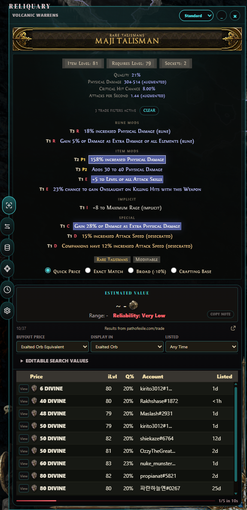
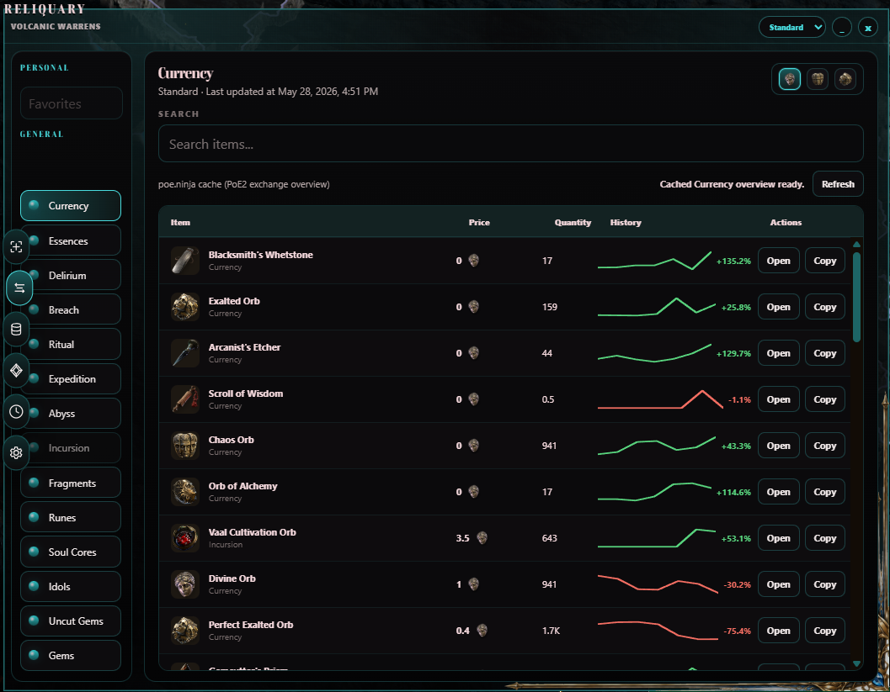
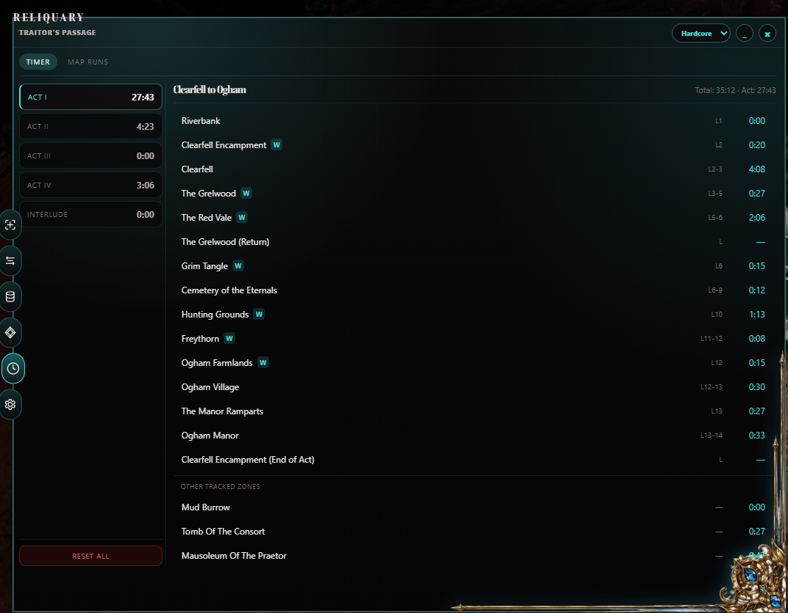
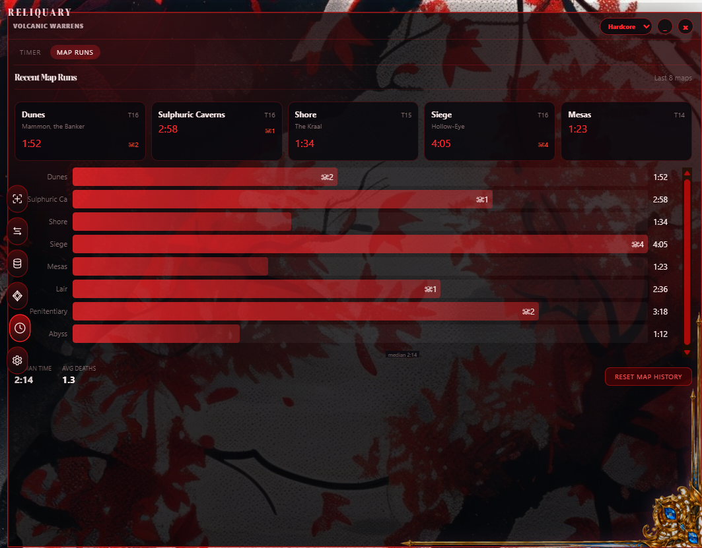
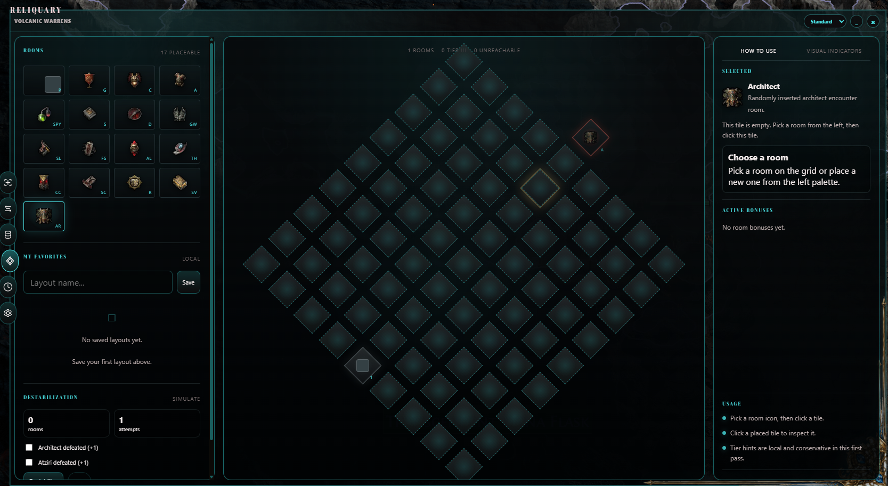
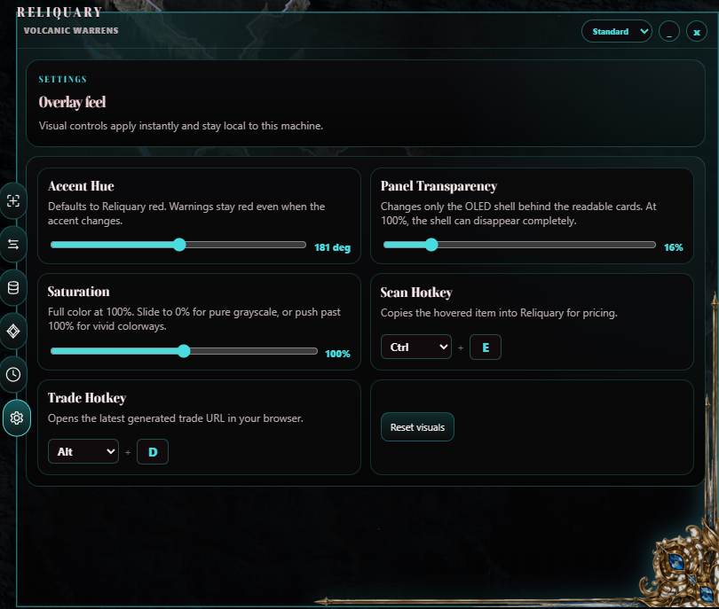

# Reliquary

Reliquary is a lightweight desktop overlay for Path of Exile 2. It helps with item evaluation, trade awareness, currency rates, map tracking, campaign routing, per-zone timers, profile-aware map warnings, and Incursion Temple planning without needing to tab out of the game.

It runs as a transparent, always-on-top overlay using Tauri v2, with a Rust backend and a TypeScript/HTML/CSS frontend. The goal is simple: keep useful information close, stay out of the way, and avoid adding unnecessary overhead while you play.

Reliquary is local-first. It does not use OAuth, does not track personal data, and keeps user-specific settings and progress on your own machine. It only fetches current game data from trusted Path of Exile sources.

Current release: **v0.1.4**.

---

## Features

### Quick Price Check Beta

Copy an item in Path of Exile 2 with `Ctrl+C`, and Reliquary parses it automatically. It identifies the item family, rarity, and modifiers, then checks live marketplace listings through the official `trade2` API.

The price check separates stronger roll-band matches from broader template-based results, tracks rate-limit pressure, caches exact-repeat searches briefly, and avoids unnecessary API spam.

This feature is intentionally labeled beta while modifier matching and official trade deep-link behavior continue to be refined against more real item examples.



### Currency Rates

The Trade tab gives you a live view of currency and exchange-item values using cached PoE.ninja economy snapshots.

You can browse categories like currency, essences, fragments, runes, soul cores, catalysts, omens, unique equipment, unique relics, and more. Reliquary also includes sparkline trends, searchable exchange data, league-aware pricing, watchlist pins, and value comparisons across multiple quote currencies.



### Profile

The Profile tab can import a public PoE.ninja character URL or a Path of Building code. Reliquary uses that snapshot to classify the build and feed safer map-warning logic.

PoE.ninja imports are preferred when available because they reflect current public leaderboard/server data. PoB imports are supported as a local fallback, but their available stats depend on the exported code.

### Atlas And Map Tracker Beta

Reliquary reads your `Client.txt` log to detect when you enter a map. From there, it shows key map details in a compact HUD strip, including waystone mod count, item rarity, pack size, rare monster chance, experience gain, mechanics, timers, and possible hazard indicators.

For area-only runs, Reliquary can also read the in-game Tab overlay through Windows OCR. This helps enrich map context when a waystone was not armed before entry. OCR is still heuristic, so the app shows confidence and evidence instead of silently pretending every read is perfect.

If a map contains mods that match your hazard catalog, Reliquary surfaces them as warnings before you commit to the run. Line mode adds severity-aware glow so risky maps stay visible even when the full overlay is collapsed.


### Campaign Tab

The Campaign tab brings your act timer, per-zone breakdown, campaign guide, and map run history into one dedicated view. It is split into two sub-tabs: Timer and Map Runs.

The act sidebar shows your current time for each act (I-IV and Interlude), alongside a per-act death counter. Selecting an act shows every zone you have visited with an individual timer. Zones in the world areas data but not in the campaign guide still show up under an *Other tracked zones* section so nothing goes unaccounted for.



Every endgame map you enter and exit is logged in the Map Runs view. The last five maps appear as compact cards across the top, and the full run history fills a horizontal bar chart below.



### Temple Planner

Reliquary includes a full Incursion Temple planner for the Temple of Atzoatl mechanic.

You can place rooms on a 9x9 isometric grid, manage room types and tiers, track adjacency requirements, plan Generator power routing, inspect room hover details, simulate destabilization, and save layouts locally. It supports all 21 room types, including special mechanics such as Spymaster medallions, Sacrificial Chamber upgrades, Architect placement, effect modifiers, and diminishing returns.



### Settings

Reliquary gives you control over how the overlay looks and behaves. The Settings tab includes sliders for accent hue, saturation, and panel transparency, so you can match the overlay to your display setup or personal taste. Warnings and hazards always stay red regardless of your chosen accent, so nothing important blends in.

Hotkeys for scanning item metadata, scanning waystone metadata, and opening trade searches are configurable to `Ctrl`, `Alt`, or any letter or digit key. Shortcuts that do not pass validation fall back to safe defaults automatically. All preferences are saved to your local machine and applied instantly.

Discord Rich Presence is enabled by default and can be turned off in Settings. It can show the imported character name, level, class artwork, current campaign area, hideout, or map, elapsed area time, and confirmed OCR mechanics. Discord login and OAuth are not required; the integration talks only to the locally running Discord client.



---

## Ready For PoE2 0.5

Reliquary is tested for Path of Exile 2 version 0.5. It includes updated league data, campaign guide steps aligned with the 0.5 patch, Atlas map context tools, and Incursion Temple support based on the 0.4/0.5 mechanic.

---

## Tech Stack

- **Tauri v2** - Desktop shell with native webview support
- **Rust** - Parsing, workers, hotkeys, window management, caching, and API calls
- **Vite + TypeScript** - Overlay UI with custom CSS and no frontend framework

---

## Data Sources

Reliquary uses data from several official and community Path of Exile sources:

- [Official Path of Exile Trade API](https://www.pathofexile.com/trade2/search/poe2) - Live marketplace listings
- [PoE.ninja](https://poe.ninja/poe2/economy/) - Cached economy snapshots, exchange rates, and optional public character snapshots
- [PoE2DB](https://poe2db.tw/us/) - Item families, league discovery, and modifier tier data
- [RePoE](https://repoe-fork.github.io/poe2/) - World area metadata, mod data, and base item tags

---

## Development

### Prerequisites

- Node.js + npm
- Rust + Cargo
- Windows 10+ as the primary target
- Linux support through Wine/Proton is experimental

### Commands

```bash
npm install
npm run dev
npm run build
npm run tauri:dev
npm run tauri:build
npm test
cargo test --manifest-path src-tauri/Cargo.toml
cargo clippy --manifest-path src-tauri/Cargo.toml --all-targets -- -D warnings
```

### CLI Modes

```bash
reliquary.exe sources --json
reliquary.exe leagues --json
reliquary.exe tiers --json
reliquary.exe debug-log --tail 40
```

### Environment Variables

| Variable | Purpose |
|---|---|
| `POE2_CLIENT_LOG` | Override the `Client.txt` path for development. |
| `RELIQUARY_BANNED_MODS` | Use a custom hazard catalog JSON file. |
| `RELIQUARY_POE2_LEAGUE` | Override the startup league. |
| `RELIQUARY_DEBUG_LOG` | Override the debug log path. |
| `RELIQUARY_DISCORD_APP_ID` | Optional override for Reliquary's built-in public Discord Application ID. |

---

## Credits & Inspiration

Reliquary builds on ideas, tools, data, and references from the Path of Exile community:

- **[Exiled Exchange 2](https://github.com/Kvan7/Exiled-Exchange-2)** - MIT License. Copyright (c) 2020 Alexander Drozdov
- **[Exile-UI](https://github.com/Lailloken/Exile-UI)** - MIT License. Copyright (c) Lailloken
- **[Sulozor](https://sulozor.github.io)** - Atziri Temple planner reference
- **[Fontshare / Boska](https://www.fontshare.com/fonts/boska)** - Local bundled UI font
- **[PoE2DB](https://poe2db.tw/us/)** - Wiki content licensed under [CC BY-NC-SA 3.0](https://creativecommons.org/licenses/by-nc-sa/3.0/). Copyright (c) 2014-2026 PoE2DB
- **[PoE.ninja](https://poe.ninja)** - Economy data and exchange rates

---

## License

MIT License - see [LICENSE](LICENSE) for full terms.

**Additional Terms - Machine Learning Prohibition:**
Permission is not granted for this software to be used for machine learning training, text and data mining, or artificial intelligence model generation. Automated harvesting of this codebase for the purpose of training or feeding large language models is not permitted under this license agreement.

**Path of Exile Assets Disclaimer:**
Reliquary is an unofficial fan-made tool. It is not affiliated with, endorsed by, sponsored by, or approved by Grinding Gear Games. Path of Exile, Path of Exile 2, and related game content, trademarks, and assets are property of Grinding Gear Games.
